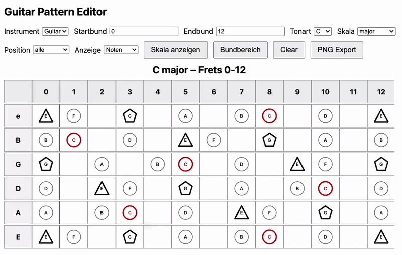

# Guitar Pattern Editor

Interactive fretboard tool for exploring scales and patterns on **guitar and bass**.

The editor allows you to visualize scales, explore interval relationships and
create custom note patterns directly on the fretboard.

## Demo

## 🎸 Try the App

## Features

- Guitar fretboard
- Bass fretboard
- Select root note
- Select scale
- Custom fret range
- Interval / note display
- Click notes to build patterns

## Screenshots

### Guitar – C Major Scale

### Bass – C# Minor (Frets 4–9)

## Usage

1. Select **instrument**
2. Choose **root note**
3. Choose **scale**
4. Adjust fret range if needed
5. Click notes to build patterns

## Roadmap

Planned features:

- Sequence mode for solo ideas
- Line visualization
- Pattern saving
- Export diagrams
- Mobile PWA version

## Technology

- Vanilla JavaScript
- SVG based fretboard rendering
- GitHub Pages hosting
- Progressive Web App (PWA)

## License

MIT License

## Author

Created by Michael Bollow
